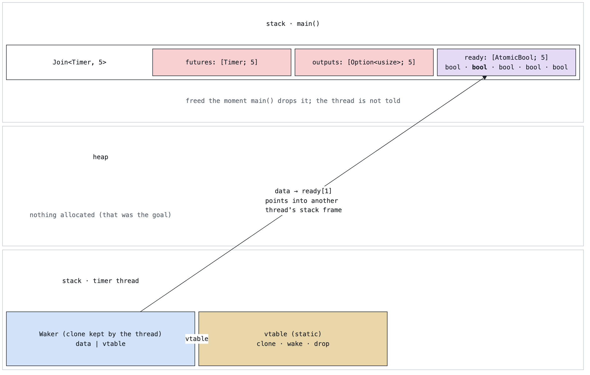
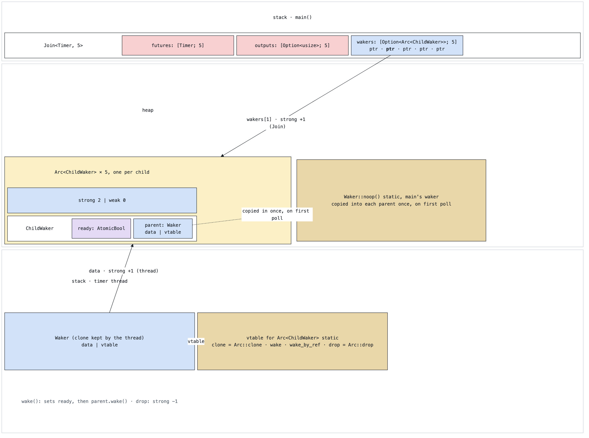
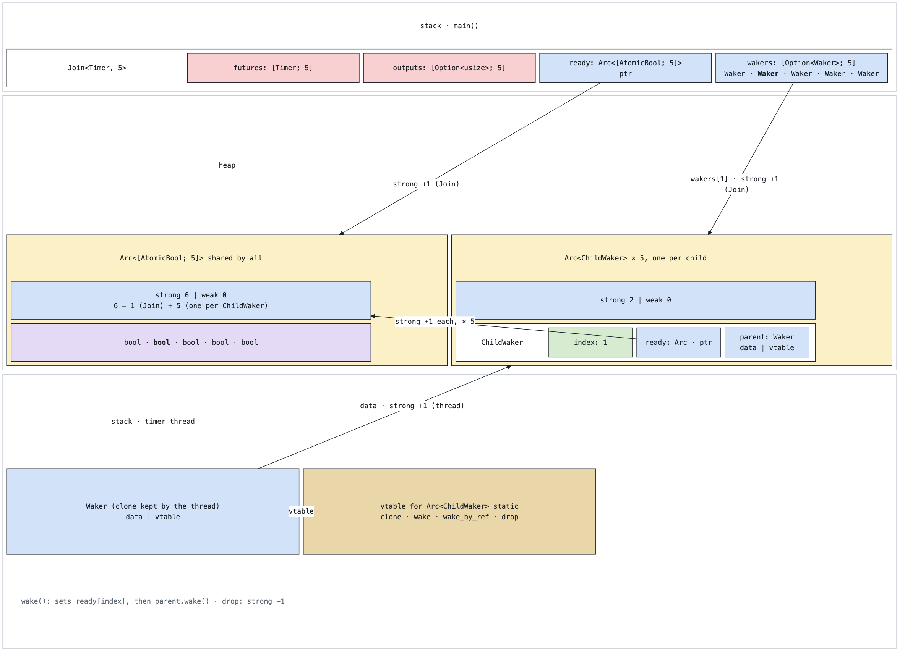

#+TITLE: Who holds the child waker's memory?
#+DATE: 2026-09-09
#+STARTUP: inlineimages

Memory-layout figures for the =Join= child-waker designs in =src/bin/pin1.rs= and
=src/bin/pin2.rs=, in the spirit of the [[https://johnbsmith.github.io/Informatik/Rust/Dateien/Rust-container-cheat-sheet.pdf][Rust container cheat sheet]].
Three layouts for the same idea: each child future gets its own waker, and the waker flips a
"ready" flag when it fires. They differ only in where the flag lives and who keeps it alive.

Rendering: each block is =ob-mermaid= (=block-beta=, so the three memory regions span the full
width); =C-c C-c= on a block writes =images/waker-*.png= and the image shows inline
(=C-c C-x C-v= toggles). Every colour is a =classDef= line at the bottom of the block. Angle
brackets in labels are written =&lt;= / =&gt;=, which mermaid needs so it doesn't read them as
HTML. Block diagrams give every row in a region the same height, so keep regions to a title row
plus one content row where possible, and never put a plain cell in the same row as a nested block.

| class    | fill      | meaning                                    |
|----------+-----------+--------------------------------------------|
| ptr      | =#d2e2f8= | pointer, one word                          |
| size     | =#d7ebd1= | integer                                    |
| atomic   | =#e4daf5= | atomic                                     |
| type     | =#f8d0d1= | our struct                                 |
| vt       | =#e9d6a9= | vtable, static                             |
| (style)  | =#fbf0c6= | heap allocation, owned by its strong count |

* 1. The layout you want: the flag inline in Join

An =AtomicBool= per child straight inside =Join=, nothing on the heap. The arrow from the timer
thread is the problem: a =Waker= clone held by another thread points into main's stack frame.

#+begin_src mermaid :file images/waker-inline.png :width 1200 :scale 2 :background-color white :mkdirp yes :exports results
%%{init: {"theme": "base", "themeVariables": {"fontFamily": "IBM Plex Mono, Menlo, monospace", "fontSize": "13px", "primaryTextColor": "#1c2128", "lineColor": "#1c2128", "edgeLabelBackground": "#ffffff"}}}%%
block-beta
columns 1
  block:main
    columns 1
    mainT["stack · main()"]
    block:join
      columns 4
      joinT["Join&lt;Timer, 5&gt;"]
      futures["futures: [Timer; 5]"]
      outputs["outputs: [Option&lt;usize&gt;; 5]"]
      ready["ready: [AtomicBool; 5] bool · <b>bool</b> · bool · bool · bool"]
    end
    dropnote["freed the moment main() drops it; the thread is not told"]
  end
  block:heap
    columns 3
    heapT["heap"]:3
    none["nothing allocated (that was the goal)"]
    space
    space
  end
  block:thread
    columns 3
    threadT["stack · timer thread"]:3
    waker["Waker (clone kept by the thread) data | vtable"]
    vt["vtable (static) clone · wake · drop"]
    space
  end
  waker -- "data → ready[1] points into another thread's stack frame" --> ready
  waker -. "vtable" .-> vt

  classDef ptr fill:#d2e2f8,stroke:#1c2128,color:#1c2128
  classDef size fill:#d7ebd1,stroke:#1c2128,color:#1c2128
  classDef atomic fill:#e4daf5,stroke:#1c2128,color:#1c2128
  classDef type fill:#f8d0d1,stroke:#1c2128,color:#1c2128
  classDef vt fill:#e9d6a9,stroke:#1c2128,color:#1c2128
  classDef note fill:none,stroke:none,color:#5d6673
  classDef title fill:none,stroke:none,color:#1c2128
  classDef region fill:#ffffff,stroke:#c6ccd5
  classDef inner fill:#ffffff,stroke:#1c2128
  classDef alloc fill:#fbf0c6,stroke:#1c2128
  classDef ghost fill:none,stroke:none
  class futures,outputs type
  class ready atomic
  class waker ptr
  class vt vt
  class dropnote,none note
  class mainT,heapT,threadT,joinT title
  class main,heap,thread region
  class join inner
#+end_src

#+ATTR_ORG: :width 1184
#+RESULTS:

A =Waker= may be cloned and kept anywhere for any length of time. Our timer hands one to a
thread. If its data pointer aims into =Join=, the flag only exists while main's frame does, and
Rust cannot tie the thread's lifetime to that frame. Pinning does not help: it promises =Join=
won't move, not that it outlives the pointer.

* 2. pin2.rs: flag inside the waker, one Arc per child

The flag moves into a reference-counted heap object. Two owners hold it, =Join= through its
array and the thread through its =Waker=, so it lives until the last one is gone.

#+begin_src mermaid :file images/waker-pin2.png :width 1200 :scale 2 :background-color white :mkdirp yes :exports results
%%{init: {"theme": "base", "themeVariables": {"fontFamily": "IBM Plex Mono, Menlo, monospace", "fontSize": "13px", "primaryTextColor": "#1c2128", "lineColor": "#1c2128", "edgeLabelBackground": "#ffffff"}}}%%
block-beta
columns 1
  block:main
    columns 1
    mainT["stack · main()"]
    block:join
      columns 5
      joinT["Join&lt;Timer, 5&gt;"]
      futures["futures: [Timer; 5]"]
      outputs["outputs: [Option&lt;usize&gt;; 5]"]
      wakers["wakers: [Option&lt;Arc&lt;ChildWaker&gt;&gt;; 5] ptr · <b>ptr</b> · ptr · ptr · ptr"]
      space
    end
  end
  block:heap
    columns 2
    heapT["heap"]:2
    block:arc
      columns 1
      arcT["Arc&lt;ChildWaker&gt;   × 5, one per child"]
      cnt["strong 2 | weak 0"]
      block:cw
        columns 3
        cwT["ChildWaker"]
        flag["ready: AtomicBool"]
        parent["parent: Waker data | vtable"]
      end
    end
    block:np
      columns 1
      noop["Waker::noop()   static, main's waker copied into each parent once, on first poll"]
    end
  end
  block:thread
    columns 3
    threadT["stack · timer thread"]:3
    waker["Waker (clone kept by the thread) data | vtable"]
    vt["vtable for Arc&lt;ChildWaker&gt;  static clone = Arc::clone · wake · wake_by_ref · drop = Arc::drop"]
    space
    tnote["wake(): sets ready, then parent.wake() · drop: strong −1"]:3
  end
  wakers -- "wakers[1] · strong +1 (Join)" --> arc
  waker -- "data · strong +1 (thread)" --> arc
  parent -. "copied in once, on first poll" .-> noop
  waker -. "vtable" .-> vt

  classDef ptr fill:#d2e2f8,stroke:#1c2128,color:#1c2128
  classDef size fill:#d7ebd1,stroke:#1c2128,color:#1c2128
  classDef atomic fill:#e4daf5,stroke:#1c2128,color:#1c2128
  classDef type fill:#f8d0d1,stroke:#1c2128,color:#1c2128
  classDef vt fill:#e9d6a9,stroke:#1c2128,color:#1c2128
  classDef note fill:none,stroke:none,color:#5d6673
  classDef title fill:none,stroke:none,color:#1c2128
  classDef region fill:#ffffff,stroke:#c6ccd5
  classDef inner fill:#ffffff,stroke:#1c2128
  classDef alloc fill:#fbf0c6,stroke:#1c2128
  classDef ghost fill:none,stroke:none
  class futures,outputs type
  class wakers,cnt,parent,waker ptr
  class flag atomic
  class vt,noop vt
  class tnote note
  class mainT,heapT,threadT,joinT,arcT,cwT title
  class main,heap,thread region
  class join,cw inner
  class arc alloc
  class np ghost
#+end_src

#+ATTR_ORG: :width 1184
#+RESULTS:

Strong count 2: one from =Join='s array, one from the thread's =Waker=. Whichever owner goes
away last frees the allocation, so the thread's write is always to live memory. Five children,
five allocations, nothing shared between them.

* 3. pin1.rs: flags in one shared array, wakers point at it

The article's version. Readiness flags sit together in one allocation that =Join= scans, and
each child waker carries an index plus a pointer to that array. The child waker still needs its
own =Arc=, because the thread holds a clone of it.

#+begin_src mermaid :file images/waker-pin1.png :width 1200 :scale 2 :background-color white :mkdirp yes :exports results
%%{init: {"theme": "base", "themeVariables": {"fontFamily": "IBM Plex Mono, Menlo, monospace", "fontSize": "13px", "primaryTextColor": "#1c2128", "lineColor": "#1c2128", "edgeLabelBackground": "#ffffff"}}}%%
block-beta
columns 1
  block:main
    columns 1
    mainT["stack · main()"]
    block:join
      columns 5
      joinT["Join&lt;Timer, 5&gt;"]
      futures["futures: [Timer; 5]"]
      outputs["outputs: [Option&lt;usize&gt;; 5]"]
      readyptr["ready: Arc&lt;[AtomicBool; 5]&gt; ptr"]
      wakers["wakers: [Option&lt;Waker&gt;; 5] Waker · <b>Waker</b> · Waker · Waker · Waker"]
    end
  end
  block:heap
    columns 2
    heapT["heap"]:2
    block:arr
      columns 1
      arrT["Arc&lt;[AtomicBool; 5]&gt;   shared by all"]
      acnt["strong 6 | weak 0 6 = 1 (Join) + 5 (one per ChildWaker)"]
      flags["bool · <b>bool</b> · bool · bool · bool"]
    end
    block:arc
      columns 1
      arcT["Arc&lt;ChildWaker&gt;   × 5, one per child"]
      cnt["strong 2 | weak 0"]
      block:cw
        columns 4
        cwT["ChildWaker"]
        index["index: 1"]
        cwready["ready: Arc · ptr"]
        parent["parent: Waker data | vtable"]
      end
    end
  end
  block:thread
    columns 3
    threadT["stack · timer thread"]:3
    waker["Waker (clone kept by the thread) data | vtable"]
    vt["vtable for Arc&lt;ChildWaker&gt;  static clone · wake · wake_by_ref · drop"]
    space
    tnote["wake(): sets ready[index], then parent.wake() · drop: strong −1"]:3
  end
  readyptr -- "strong +1 (Join)" --> arr
  wakers -- "wakers[1] · strong +1 (Join)" --> arc
  cwready -- "strong +1 each, × 5" --> acnt
  waker -- "data · strong +1 (thread)" --> arc
  waker -. "vtable" .-> vt

  classDef ptr fill:#d2e2f8,stroke:#1c2128,color:#1c2128
  classDef size fill:#d7ebd1,stroke:#1c2128,color:#1c2128
  classDef atomic fill:#e4daf5,stroke:#1c2128,color:#1c2128
  classDef type fill:#f8d0d1,stroke:#1c2128,color:#1c2128
  classDef vt fill:#e9d6a9,stroke:#1c2128,color:#1c2128
  classDef note fill:none,stroke:none,color:#5d6673
  classDef title fill:none,stroke:none,color:#1c2128
  classDef region fill:#ffffff,stroke:#c6ccd5
  classDef inner fill:#ffffff,stroke:#1c2128
  classDef alloc fill:#fbf0c6,stroke:#1c2128
  classDef ghost fill:none,stroke:none
  class futures,outputs type
  class readyptr,wakers,acnt,cnt,cwready,parent,waker ptr
  class index size
  class flags atomic
  class vt vt
  class tnote note
  class mainT,heapT,threadT,joinT,arrT,arcT,cwT title
  class main,heap,thread region
  class join,cw inner
  class arr,arc alloc
#+end_src

#+ATTR_ORG: :width 1184
#+RESULTS:

Two kinds of allocation. The flag array has strong count 6, one from =Join= and one from each
child waker, so it outlives everything that can write to it. Each child waker still has count 2
for the same reason as in pin2. What changed is that =Join= reads readiness from one contiguous
block it owns directly, and the wakers are stored as plain =Waker= values.

* Reading the three pictures together

The =Arc= is there because of the arrow from the thread. Any design where a child waker's data
pointer aims at memory owned by =Join= is unsound, because =Join= cannot know who still holds a
clone. Reference counting turns "who owns this" into "everyone who holds a pointer", which is
exactly the shape a waker needs.

|                                | inline (1)                   | pin2 (2)                                | pin1 (3)                                                |
|--------------------------------+------------------------------+-----------------------------------------+---------------------------------------------------------|
| Where the flag lives           | inside Join, on the stack    | inside each ChildWaker allocation       | one shared array allocation                             |
| Heap allocations for N children | 0                            | N                                       | N + 1                                                   |
| Who keeps the flag alive       | main's stack frame only      | Join and the thread, count 2            | Join and all N child wakers, count N + 1                |
| Sound?                         | no, dangles after Join drops | yes                                     | yes                                                     |
| Join checks readiness by       | reading its own field        | following N pointers                    | reading N adjacent atomics                              |
| Building the child's Context   | -                            | =Waker::from(Arc::clone)= per poll      | stored =Waker=, no refcount traffic                     |
| Next step it enables           | -                            | none, flag and waker are welded         | bitset or ready list, then one allocation for all wakers |
